# PEMROGRAMAN BERORIENTASI OBJEK

## Biodata

- **Nama** : Prevansyah Sjafar
- **NIM** : 4525210057
- **Program Studi** : Teknik Informatika
- **Kelas** : A
- **Mata Kuliah** : Pemrograman Berorientasi Objek
- **Dosen Pengampu** : Adi Wahyu Pribadi, S.Si., M.Kom

## Teknologi yang Digunakan

Tugas dibuat menggunakan dua bahasa pemrograman berikut:

- **Java** dengan Java Development Kit (JDK).
- **PHP** dengan PHP interpreter.

Visual Studio Code digunakan sebagai IDE dengan extension Java Red Hat,
PHP Intelephense, Prettier, dan Error Lens.

## Materi Pembelajaran

Repository ini berisi penerapan konsep pemrograman berorientasi objek
tugas 01 sampai tugas 06:

1. Class dan Object
2. Encapsulation dan Constructor
3. Inheritance dan Method Overriding
4. Polimorfisme
5. Asosiasi, Agregasi, dan Komposisi
6. Abstract Class dan Interface

Setiap tugas dibuat dalam versi Java dan PHP. Penjelasan implementasi yang
lebih rinci tersedia pada README di masing-masing folder tugas.

---

## Tugas 01 - Class dan Object

### Deskripsi Tugas

Pada tugas ini, class iPhone berfungsi sebagai template untuk membentuk object. Dibuat dua object iPhone yang warna dan kapasitas penyimpanannya berlainan, kemudian keduanya dicetak datanya dengan memanggil method getColor() dan getStorage().

### Screenshot Hasil Run

#### Hasil Run Java

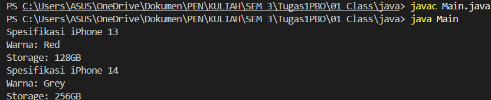

#### Hasil Run PHP

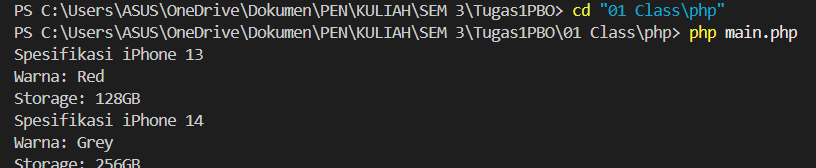

---

## Tugas 02 - Encapsulation dan Constructor

### Deskripsi Tugas

Tugas ini mendemonstrasikan encapsulation lewat class Mahasiswa. Property nama, nim, dan umur disembunyikan dengan modifier private, jadi data tersebut hanya dapat dibaca atau diubah melalui getter dan setter.

### Screenshot Hasil Run

#### Hasil Run Java

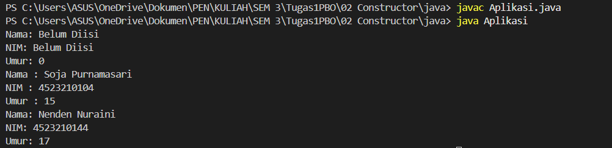

#### Hasil Run PHP

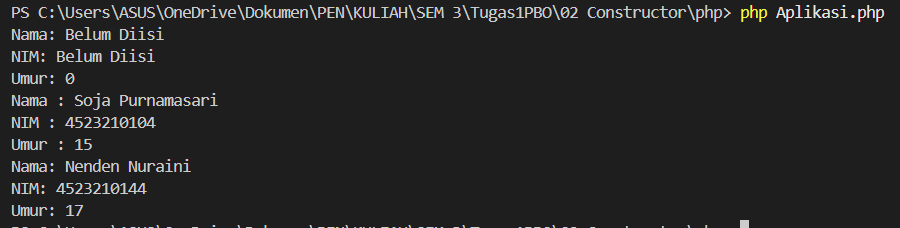

---

## Tugas 03 - Inheritance dan Method Overriding

### Deskripsi Tugas

Konsep inheritance dan method overriding dipraktikkan dalam dua kasus. Kasus pertama adalah class BangunDatar yang menurunkan sifatnya ke Lingkaran, Persegi, dan Segitiga. Kasus kedua adalah class MahasiswaInternational yang merupakan turunan dari class Mahasiswa.

### Screenshot Hasil Run

#### Hasil Run Java

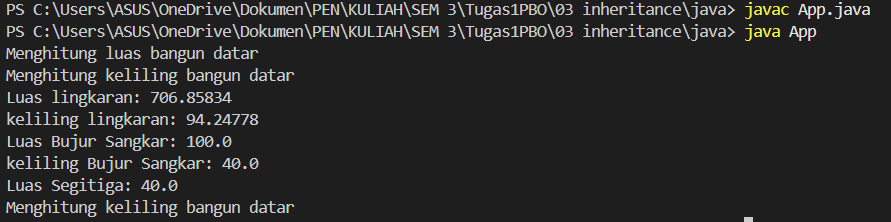

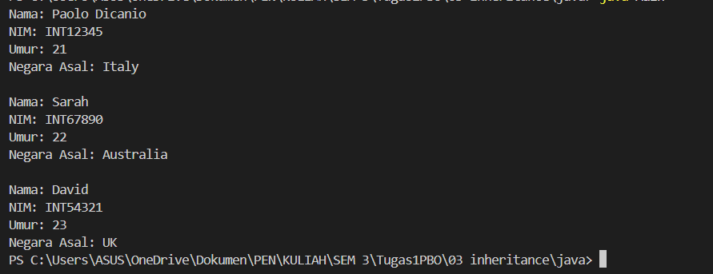

#### Hasil Run PHP

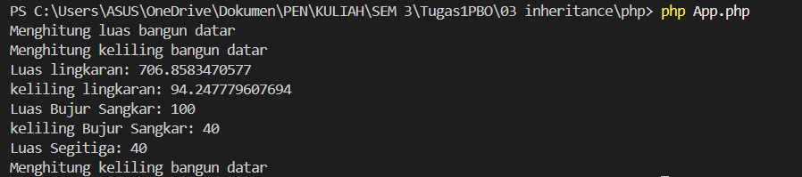

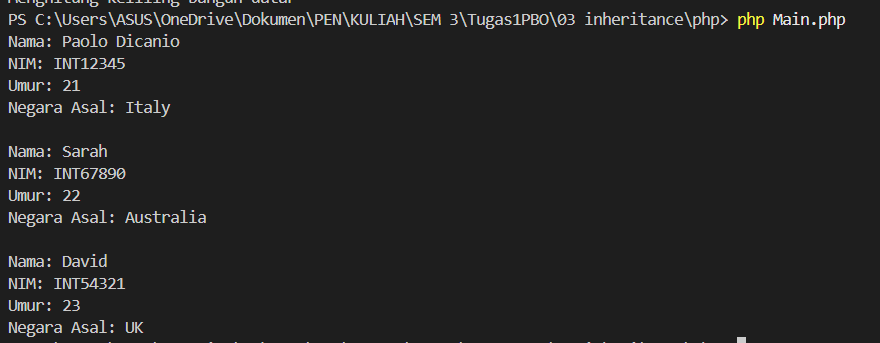

---

## Tugas 04 - Inheritance dan Polimorfisme

### Deskripsi Tugas

Tugas ini memperlihatkan inheritance dan polimorfisme dengan class Handphone sebagai induk. Class Smartphone dan FeaturePhone menurunkan Handphone, lalu masing-masing menulis ulang method nyalakan(), matikan(), dan telepon() sesuai karakteristiknya.

### Screenshot Hasil Run

#### Hasil Run Java

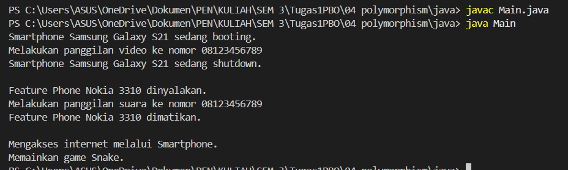

#### Hasil Run PHP

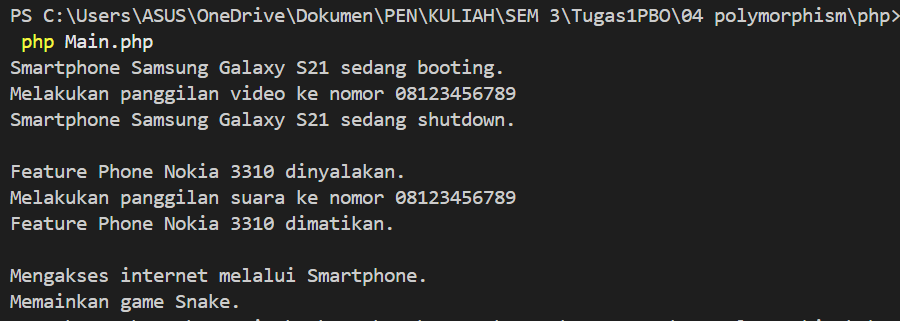

---

## Tugas 05 - Asosiasi, Agregasi, dan Komposisi

### Deskripsi Tugas

Tugas ini membahas cara object saling berhubungan melalui tiga bentuk relasi: asosiasi, agregasi, dan komposisi.

### Screenshot Hasil Run

#### Hasil Run Java

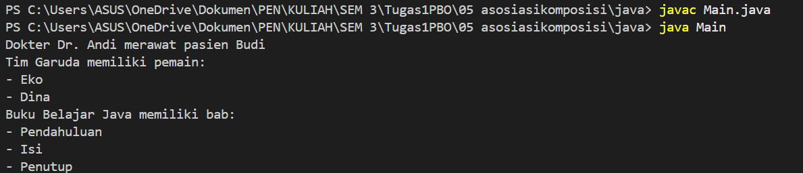

#### Hasil Run PHP

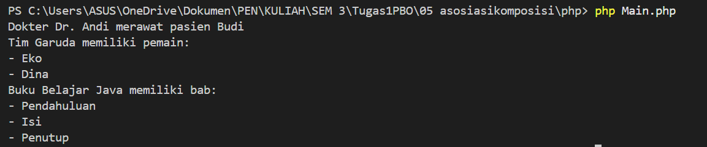

---

## Tugas 06 - Abstract Class dan Interface

### Deskripsi Tugas

Tugas ini memakai abstract class dan interface. Abstract class Vehicle menjadi induk bagi beberapa jenis kendaraan, sementara interface Movable dan Fuelable mendefinisikan kemampuan yang bisa dimiliki oleh suatu object.

### Screenshot Hasil Run

#### Hasil Run Java

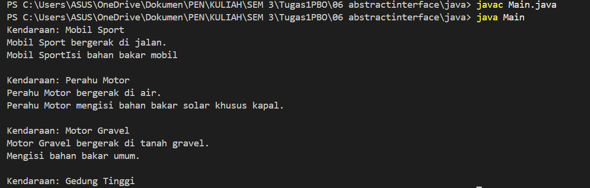

#### Hasil Run PHP

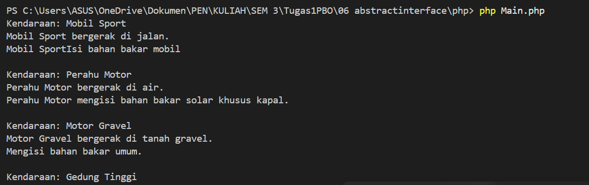
